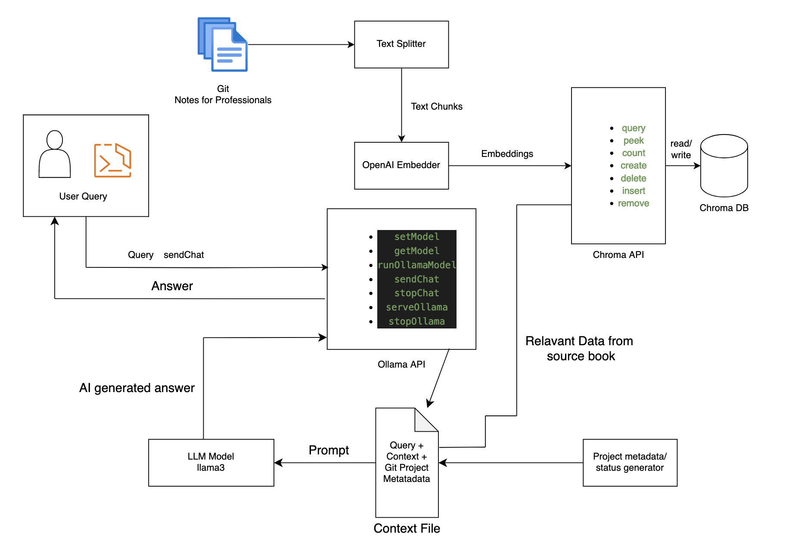

# Revolutionizing Version Control: An AI-Powered Approach to Simplifying Git

**Author**: Georges Arthur Engono | [georges.arthur.engono.essame@umontreal.ca](mailto:georges.arthur.engono.essame@umontreal.ca)
**Supervisor**: Eugène Syriani |  [syriani(@)iro.umontreal.ca](mailto:syriani(@)iro.umontreal.ca)

---

### Introduction

In the world of software development, version control systems are indispensable for managing changes to source code over time. Git, created by Linus Torvalds in 2005, has emerged as the predominant version control system, lauded for its flexibility and distributed nature. However, its widespread adoption has not been without challenges. The steep learning curve, complex command syntax, and inefficient workflows have been significant barriers for many evelopers, particularly those new to version control or those working in fast-paced, collaborative environments.

### Problem Statement 

Git's robust functionality is overshadowed by its user-unfriendly interface and complex workflows. Major challenges include:

- **Non-Intuitive Design**: While powerful, Git's user interface is complicated, often requiring deep understanding or memorization of commands.
- **Confusing Command Syntax**: Git commands can be perplexing, with multiple functionalities often packed into a single command, leading to user confusion.
- **Merge Conflicts**: A significant amount of time is spent avoiding or resolving merge conflicts, particularly in teams working on different features simultaneously.
- **Steep Learning Curve**: Git's learning curve is daunting, necessitating the learning of a domain-specific language, which can lead to critical errors.
- **Increased Workflow Steps**: Tasks that are straightforward in other systems, like TFS, are more cumbersome in Git, requiring additional steps and time.

These challenges can hinder productivity, increase frustration, and elevate the risk of errors, particularly for new contributors and smaller project teams.

### Proposed Solution: AI-Powered Chatbot for Git in CLI

To revolutionize the way developers interact with Git, we propose the development of an AI-powered chatbot, integrated within the Command Line Interface (CLI). This solution is designed to simplify Git commands and workflows, making them more accessible and efficient. The chatbot will offer the following features:

- **Natural Language Interaction**: Users can communicate with Git through natural language queries and instructions. Instead of typing traditional Git commands, users can ask questions like, "How do I commit my changes?" or state commands such as, "Update my branch with the latest changes from the main branch."

- **Project Structure Awareness**: The chatbot will have a deep understanding of the current project's structure. It will be aware of critical details like previous commits, the number of branches, active contributors, and recent changes. This knowledge allows the chatbot to provide contextually relevant advice and actions, tailored to the specific state and needs of the project.

- **Personalized Assistance and Error Prevention**: By understanding the project's context and user's intent, the chatbot can offer personalized guidance. It can suggest the most appropriate Git actions, help avoid common mistakes, and alert users to potential conflicts or issues based on the project's history and current status.

- **Facilitating Complex Operations**: The chatbot can assist with more complex Git operations that typically require multiple steps and a deep understanding of Git's intricacies. For example, it can guide users through resolving merge conflicts, rebasing branches, or managing pull requests.

- **Seamless CLI Integration**: This chatbot will be a part of the CLI environment, ensuring that developers can access its capabilities without leaving their terminal or interrupting their workflow. This integration provides a smooth, cohesive experience, blending the power of AI with the familiarity of the CLI.

  

### High-Level Architecture





This diagram illustrates a high-level architecture for the AI-powered system designed to process Git commands using an LLM (llama3) model. Here's a summary of the workflow:

1. **Git Notes For Professional**: This contains the source of truth for git related questions. [Git Notes For Professional](https://goalkicker.com/GitBook/GitNotesForProfessionals.pdf) is a 200 pages open source book that answers questions about git.
2. **Text Splitter**: The input Git commands are split into smaller chunks of text. This step is necessary for parsing and make the input more manageable for processing.
3. **Embedding API**: The chunks from the text splitter are passed to an embedding API, which converts the text into numerical vector representations (embeddings). These embeddings capture the semantic meaning of the chunks in a format suitable for machine processing. I'm using currently using OpenAI's emmbeding function for this project. To read more about what vector embeddings are, see [here](https://www.elastic.co/what-is/vector-embedding).
4. **Vector Database**: The embeddings are stored or matched against a vector database, such as Chroma. This database can be used for searching and retrieving relevant documents based on similarity in the vector space.
5. **Query**: This represents the user's query or command that needs to be processed entered from the user's CLI.
6. **Git Project Data**: This includes structured data about the Git project in a JSON format containing metadata, branch information, commit history, etc.  This information is taken by running a git script (with commands such as `git status` and `git branch`) in a child process.
7. **LLama3 Model**: This is the AI model (like GPT-4) which processes the user's query, the Git project data, and the context (possibly including the relevant documents retrieved from the vector database). It generates an answer or output based on this information.
8. **Answer**: This is the final output from the Llama3 model, which is the system's response to the user's query. It could be a direct answer, a Git command execution result, or further guidance on Git operations.

This architecture uses natural language processing and semantic search with a vector database to interpret Git commands, fetch relevant project data, and provide intelligent responses and actions based on the context of the Git project.


### Git Project Model

Creating a model for representing Git projects enhances the bot's understanding of the project's intricate details and current status. This structured approach allows for more accurate, context-aware responses, tailored to the unique characteristics and needs of each project. It significantly improves the bot's ability to handle complex queries, offer predictive suggestions, and prevent potential errors by understanding the project's dynamics.

**Project Metadata**

- `project_name`: String
- `repository_url`: String
- `creation_date`: DateTime
- `last_updated`: DateTime
- `primary_language`: String
- `description`: String

**Branch Information**

- branches: List of Branches
  - Branch:
    - `name`: String
    - `last_commit`: String (Commit Hash)
    - `created_date`: DateTime
    - `last_updated`: DateTime
    - `is_default`: Boolean

**Commit History**

- commits: List of Commits
  - Commit:
    - `hash`: String
    - `author`: String
    - `date`: DateTime
    - `message`: String
    - `branch_name`: String

**File Status**

- files: List of Files
  - File:
    - `file_name`: String
    - `status`: Enum (Modified, Untracked, Deleted)
    - `last_modified`: DateTime

**Issues and Pull Requests**

- issues: List of Issues
  - Issue:
    - `id`: Integer
    - `title`: String
    - `status`: Enum (Open, Closed)
    - `created_date`: DateTime
    - `closed_date`: DateTime (optional)
- pull_requests: List of Pull Requests
  - Pull Request:
    - `id`: Integer
    - `title`: String
    - `status`: Enum (Open, Closed, Merged)
    - `created_date`: DateTime
    - `closed_date`: DateTime (optional)
    - `branch_source`: String
    - `branch_target`: String

**Collaborators**

- collaborators: List of Collaborators
  - Collaborator:
    - `username`: String
    - `role`: Enum (Contributor, Maintainer, Owner)

**Configuration and Settings**

- configurations: Dictionary
  - Key-value pairs for various Git settings (e.g., `merge.conflictstyle`, `core.autocrlf`).


Here's the git script to get some information about the project : 

```bash
#!/bin/bash

# Get branch information
echo "Branches and their last commit:"
for branch in $(git branch --list | sed 's/* //'); do
    echo "Branch: $branch"
    echo "Last Commit: $(git log $branch -1 --pretty=format:'%H')"
    echo "Last Commit Date: $(git log $branch -1 --pretty=format:'%aI')"
    echo "Last Commit Author: $(git log $branch -1 --pretty=format:'%aN')"
    echo "Last Commit Message: $(git log $branch -1 --pretty=format:'%s')"
done

echo ""
echo "Commit History for each branch:"
for branch in $(git branch --list | sed 's/* //'); do
    echo "Commit History for $branch:"
    git log $branch --pretty=format:'{"commit": "%H", "author": "%aN", "date": "%aI", "message": "%s"},' | awk '{print}' ORS=' '
    echo ""
done

echo ""
echo "Current Git Status:"
git status 

```

The GitHub or GitLab APIs will be required for the missing informations.


### Components

##### Frontend - CLI

This component is the primary user interface for the AI-powered system designed to process Git commands. It is built using `@inquirer/prompts` (npm link [here](https://www.npmjs.com/package/@inquirer/prompts)), a Node.js library known for facilitating the creation of interactive command line user interfaces. This component is essential for capturing user inputs through a series of intuitive prompts, making the interaction with the system both straightforward and efficient.

##### Git commands - Vector Database

The Vector Database component of the system utilizes [Chroma](https://www.trychroma.com), an AI-native, open-source embedding database optimized for handling and storing embedding vectors. Chroma supports efficient similarity searches in high-dimensional vector spaces, making it ideal for applications requiring rapid and accurate retrieval of information based on semantic similarity. This component is crucial for matching the embedding vectors derived from user inputs and Git command data to relevant stored documents, enabling intelligent query processing and response generation. 

It is deployed locally using Docker, ensuring easy setup and scalability while maintaining control over data privacy and security.

##### Embedding Generator

 The Embedding API component leverages [OpenAI's text-embedding function](https://platform.openai.com/docs/guides/embeddings), specifically the `text-embedding-ada-002` model, to convert text inputs into numerical vector representations known as embeddings. This function captures the semantic meaning of the text, transforming it into a format that can be efficiently processed by machine learning algorithms. These embeddings are crucial for enabling the AI-powered system to understand and analyze the context and content of Git commands and related queries. The use of this advanced embedding technology ensures high accuracy and relevance in the system's responses and operations.

##### Llama3

[Llama 3](https://llama.meta.com/llama3/) is an AI language model developed by Meta that can understand and generate language. It comes in two sizes, with the larger (70B) version offering more power, and is compatible with Meta's chat assistants across Facebook, Instagram and WhatsApp. Llama 3 is available for free, encouraging development and research across various fields. It is the successor to Llama 1 and 2, with improvements in logic, understanding and factual accuracy. For this project, the Llama 3 7B was used. 

##### Ollama

The LLama 3 Model component utilizes [Ollama](https://ollama.com/), a lightweight and extensible framework designed for local execution of large language models (LLMs). Ollama enables developers to harness the powerful capabilities of models such as LLama 3, Mistral and other LLMs directly on their own machines. This framework is integral to the AI-powered system, facilitating real-time processing of Git commands and queries by interpreting user input, Git project data, and relevant documents. Ollama's adaptability ensures that developers can easily update and maintain the model, improving response accuracy and system performance over time without the need for constant internet connectivity or external computing resources.  

### Roadmap


### Weekly Update

#### Week 1 & 2

Drafted the initial design document and the template for my final report.

Wrote the design document and researched different components of the project. I set up a website for this class where I will be posting my weekly updates.

#### Week 3 & 4

I created the NPM package which will contain the source code of this project.

- #### [This is where it all begins...](https://github.com/georgesengono/git-ai/commit/415cddccf0ae3634e8c6981ec5422a582bcfca42)

I created the text splitter that will be used to split the large pdf file that will serve as a knowledge base for the LLM AI.

- #### [Add function to get token count of text](https://github.com/georgesengono/git-ai/commit/88b78beb838388af81eef8b2eacaf30c879d4f6c)

- #### [Add sentence splitter](https://github.com/georgesengono/git-ai/commit/af2f77747286229e8b108c95248fb71846b7c5f0)

- #### [Add function to group sentences with overlap](https://github.com/georgesengono/git-ai/commit/c569bffe1591fb1f6e0489e99a750f8885617b07)

- #### [Add text splitter function](https://github.com/georgesengono/git-ai/commit/70f8fa13405f0e00365551fa453b82baf838127a)

I created the OpenAI wrapper class which will be used to interact with the OpenAI api and I implemented the GenerateEmbedding function to generate the embeddings of a given input text.

- #### [Add embedding generator](https://github.com/georgesengono/git-ai/commit/929bb1dab494028355405e3c9f598d026c49f046)


#### Week 5 - 8

These weeks have been more busy than I expected due to the workload from my four other classes. With that being said, I was able to stay on track with my schedule and create the vector database and populate it with git commands comming from the following book that I found online : https://goalkicker.com/GitBook/GitNotesForProfessionals.pdf

I decided to go with the ChromaDB due to the fact that it is an open-source vector database for AI, notable for its scalability, ease of use and in-memory capabilities.

I'm using a Docker container to run the ChromaDB.

- #### [Add git commands data files](https://github.com/georgesengono/git-ai/commit/b924504e1f40903aac606e852f26622891ecf1fd)

- #### [Add script to setup vector db and chroma-client](https://github.com/georgesengono/git-ai/commit/7427448896e9f6832e128c31dc5991cbcb0374af)

In the following weeks, I will be working on the Git API wrapper to get in real time contextual data about a client's project/


#### Week 8 - 11

Progress on my AI-GIT project is in line with the initial plan. I've implemented a child process to run a bash script that executes the necessary Git commands to collect current project data, including branches, commits, and recent changes. The upcoming week will be dedicated to integrating the Language Model (LLM) with the chatbot. I plan to augment the bash script with additional Git commands and utilize the GitHub API to give the LLM a more comprehensive overview of the project. 

Bash script to get project status : https://github.com/georgesengono/git-ai/blob/main/src/common/git-script.sh

- #### [Add GitClient part. 1](https://github.com/georgesengono/git-ai/commit/65928e80378697b92e6765d6e1e0630eb3d12ddd)

- #### [Add git child process to save project status](https://github.com/georgesengono/git-ai/commit/5925a5333e5b818d9b3d7ba98bc018b392a1383f)


I'm considering using LLama2 and OpenAI's GPTs.  The LLM should be able to take the project status and relevant documentation from the semantic search (that I worked on from weeks 5-8) and generate a context-aware answer to help the user.

#### Week 11 - 

I have implemented the LLM using Ollama. For this project I'm using llama 3 as the LLM model.


### Future Updates

#### 1- Moving the LLM model to an EC2 instance and make it available trough an API.

In future updates for the git-ai project, we plan to enhance performance and scalability by migrating the llama3 LLM model to an [EC2](https://aws.amazon.com/ec2/) instance in the Amazon Web Services cloud. This transition will ensure that the computational demands of the LLM are managed independently of the user’s local machine. By leveraging the cloud's robust infrastructure, we aim to provide a more reliable and efficient service, allowing users to experience consistent performance regardless of their own hardware capabilities. This update is expected to not only improve response times but also enable more complex processing tasks without burdening the user's system.

#### 2- Use the GitHub and GitLab APIs to get more information about the project

In an upcoming development phase of the git-ai project, we plan to introduce a comprehensive web interface designed to further enhance user interaction and functionality. This interface will allow users to seamlessly connect their GitHub and GitLab accounts directly with the git-ai system. By integrating with these version control platforms, the chatbot will be able to access a wider range of project-specific data, enabling it to deliver more context-aware responses. This capability will not only streamline the user experience but also enrich the chatbot's understanding of the user's projects, thereby facilitating more precise and insightful assistance with their version control needs.

#### 3- Add memory to chat and provide the user the ability to add custom rules

In the next phase of enhancements for the git-ai project, we plan to significantly expand the chatbot's capabilities by integrating a memory feature. This upgrade will enable the chatbot to recall previous conversations, thereby providing continuity and context in ongoing interactions with users. Additionally, we will introduce functionality that allows users to implement custom rules within the chatbot. These rules could be tailored to specific company policies or project guidelines, enhancing the chatbot's utility and adaptability. For instance, a user could set up a rule for the chatbot to alert them whenever a 'git pull' is necessary, ensuring they remain updated with the latest changes in their repository. This level of customization will not only make the chatbot more responsive to individual project needs but also more proactive in managing routine tasks.

### Demo

[Link to demo ](https://udemontreal-my.sharepoint.com/:v:/g/personal/georges_arthur_engono_essame_umontreal_ca/EVsyPIvKmH5EvEC5ruEg7TMBv6t6p6WDcdjIG-czVBoHOA?nav=eyJyZWZlcnJhbEluZm8iOnsicmVmZXJyYWxBcHAiOiJPbmVEcml2ZUZvckJ1c2luZXNzIiwicmVmZXJyYWxBcHBQbGF0Zm9ybSI6IldlYiIsInJlZmVycmFsTW9kZSI6InZpZXciLCJyZWZlcnJhbFZpZXciOiJNeUZpbGVzTGlua0NvcHkifX0&e=1nfhk1) (the demo was done in French)

### GitHub Repository

[Link to repo](https://github.com/georgesengono/git-ai).

